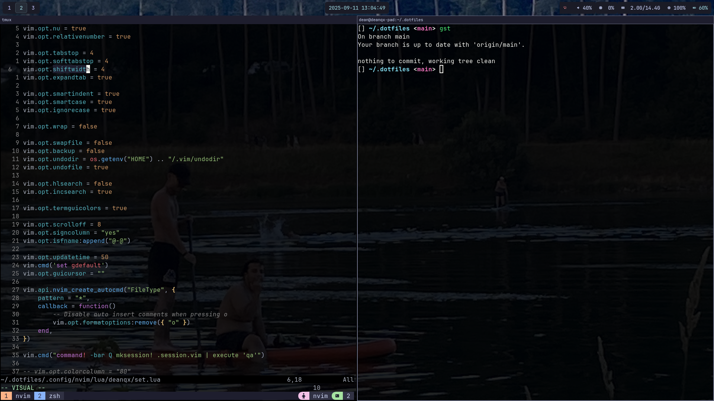

 My Linux configuration files.

# Features

- Distro: Archlinux
- Shell: zsh
- Editor: Neovim
- Terminal multiplexer: tmux

Setup                | Nvidia GPU | AMD GPU
-------------------- | ---------- | ----------
Window System        | X11        | Wayland
Window Manager       | i3wm       | sway
Terminal Emulator    | Alacritty  | Alacritty

## Preview



## Switch Audio

This is configured in the [i3 config](.config/i3/config).

Press `CMD+Shift+a` to switch audio output device.

## Neovim

### Keep currently open files

After opening Neovim with:

```
vim
```

Use `:Q` to quit and save the session in a `.session.vim` file.
The same command opens the session from current directory.

# Installation

## 1 Follow Arch Installation guide

[Arch Installation guide](https://wiki.archlinux.org/title/Installation_guide)

Before continuing installation steps sync your package database:

```
# pacman -Sy
```

## 2 Install a window system

You can choose between [i3wm](https://wiki.archlinux.org/title/I3) ([X11](https://wiki.archlinux.org/title/Xorg))
or [sway](https://swaywm.org/) ([Wayland](https://wayland.freedesktop.org/)).

### 2.1 Install desktop fonts

```
# pacman -S noto-fonts ttf-jetbrains-mono-nerd
```

### 2.2 sway installation

```
# pacman -S xorg-xwayland sway waybar fuzzel grim slurp foot swaybg wl-clipboard
```

ly

```
cat /usr/share/wayland-sessions/sway.desktop
Exec=~/launch_sway_nvidia.sh
```

## 3 Install basic programs

```
# pacman -S git zsh sudo
```

- `git`
- `zsh`
- `sudo`

## 4 User setup

```
groupadd sudo
```

Uncomment this line in `/etc/sudoers` to allow all users in `sudo` group to have root privileges.

```
%sudo ALL=(ALL:ALL) ALL
```

```
# useradd -m -G sudo -s /usr/bin/zsh your_username
```

- `-m` Create home directory
- `-G` Group
- `-s` Default shell

```
# passwd your_username
# su your_username
```

## 5 Download dotfiles

```
cd ~
git clone https://github.com/deanqx/.dotfiles
```

git pull --recurse-submodules

```
cd .dotfiles
./install.sh
```

## 6 Launching window manager

Reload env or reboot

Depending on your setup execute [sway](https://swaywm.org/) or [i3wm](https://wiki.archlinux.org/title/I3).

## 7 Optional

### Apple Emojis

Install Apple looking Emojis from the AUR.

```
paru -S ttf-apple-emoji
```

### LanguageTool for Neovim

I use LTeX for that. Download the [binaries](https://github.com/valentjn/ltex-ls/releases/download/16.0.0/ltex-ls-16.0.0-linux-x64.tar.gz).

```
tar -xf ~/dload/ltex-ls-16.0.0-linux-x64.tar.gz -C ~/.local/share/nvim/language_servers
```

### Git config

To keep for example `git log` on screen after quitting.

```
git config --global core.pager "less -X"
```

### tmux

```
tmux
```

Press `<C-Space>` + `I` to install plugins.

```
tmux kill-server
```

### Firefox custom background

Add this to `userContent.css` to show background image on Firefox `about:newtab`:

```css
@-moz-document url-prefix(about:newtab) {
    body {
        background: linear-gradient(rgba(0, 0, 0, 0.6), rgba(0, 0, 0, 0.7)),
            url(Wallpapers/image.JPG) !important;
        background-size: cover !important ;
    }
}
```
