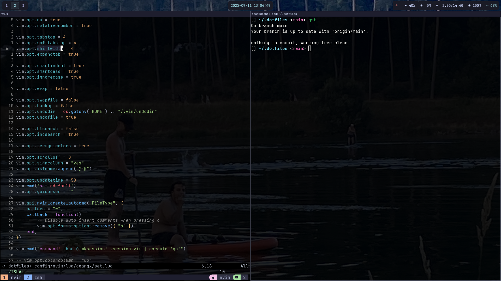

My Linux configuration files for desktop.

# Features

- Distro: Archlinux
- Desktop: sway (Wayland)
- Shell: zsh
- Editor: Neovim
- Terminal: foot with tmux

## Preview


Sep 11, 2025

# Installation

## 1 Complete the Arch Installation guide

[Arch Installation guide](https://wiki.archlinux.org/title/Installation_guide)

Before continuing installation steps sync your package database:

```sh
sudo pacman -Sy
```

After you completed the Arch Installation Guide,
clone this repo into your home directory:

```sh
cd ~
git clone https://github.com/deanqx/.dotfiles
```

## 2 Install recommended packages

```sh
sudo pacman --needed -S - < ~/.dotfiles/packages_pacman.txt
```

## 3 AUR Package-Manager

Paru is used for this system:

```sh
git clone https://aur.archlinux.org/paru.git
cd paru
makepkg -si
```

After installation, you can delete the `paru` folder.

## 4 Enable Services

### 4.1 Pipewire for Audio

```sh
systemctl --user enable --now pipewire pipewire-pulse wireplumber
```

### 4.2 Ly as Login-Manager

If you are using an Nvidia GPU modify the `Exec`
in `/usr/share/wayland-sessions/sway.desktop` as following:

```ini
Exec=~/.launch_sway_nvidia.sh
```

```sh
sudo systemctl enable ly@tty1
sudo systemctl disable getty@tty1
```

### 4.3 Enable Time Synchronization

```sh
sudo systemctl enable --now ntpd
```

### 4.4 SSH Password Caching

```sh
systemctl --user enable --now ssh-agent
```

To make all ssh clients (including git) store keys in the cache on first use,
add the configuration setting `AddKeysToAgent yes` to `~/.ssh/config`:

```
Host *
   AddKeysToAgent yes
```

## 5 Install

```sh
cd .dotfiles
git pull --recurse-submodules
./install.sh
```

## 7 Optional

### Recommended folder structure for the home directory

- `Areas`: [Johny.Decimal System](https://johnnydecimal.com/documentation/introduction)
- `Inbox`: Downloads
- `Music`
- `Screenshots`
- `Wallpapers`

### Emacs (Editor and more)

I currently use Doom Emacs a configuration framework for Emacs for an out of the
box experience. It's perfect for users coming from Vim as it uses vim keybindings.

```sh
sudo pacman -S emacs-wayland
```

For spell checking:

```sh
sudo pacman -S enchant hunspell-de hunspell-en-us
```

Install Doom Emacs:

```sh
git clone --depth 1 https://github.com/doomemacs/doomemacs ~/.config/emacs
```

```sh
~/.config/emacs/bin/doom install
```

When prompted:

- Generate an envvar file? -> Yes (y) (Captures environment variables for Doom).
- Download font vector icons? -> Yes (y) (Installs all-the-icons).

#### Email in Emacs

```sh
mkdir -p ~/.mail/{personal,work}
```

Setup `notmuch` which acts as the user interface and database to the locally
synced emails. Choose `/home/USER/.mail` as location:

```sh
notmuch setup
```

```
...
Top-level directory of your email archive []: /home/USER/.mail
```

Add the following to your `~/.notmuch-config`:

```
[new]
tags=new
ignore=/.*[.](json|lock|bak)$/
```

Init `notmuch` database:

```sh
notmuch new
```

For **GMail**:

```sh
paru -S lieer-git
```

`lieer-git` provides the `gmi` binary.

```sh
cd ~/Mail/personal
gmi init YOUR@gmail.com
gmi set --ignore-tags-local new
gmi sync
```

### Syncing files between devices

Syncthing provides encrypted, peer-to-peer file synchronization directly between
devices without a server required.

#### 1 Installation

```sh
sudo pacman -S syncthing
systemctl enable --user --now syncthing
```

Web interface is available at [http://localhost:8384/](http://localhost:8384/).

#### 2 Pair devices and Sync

1. Open [http://localhost:8384/](http://localhost:8384/)
2. Select a folder to synchronize (e.g. `~/.org`).
3. Get PC Device ID by going to `Actions` -> `Show ID`.
4. For Android install the `Syncthing-Fork` app.
5. In the app select `Devices` -> `Add device` (top right corner).
6. Scan the QR-Code
7. On the PC accept the Android phone and select folders to synchronize in
   the `Sharing` tab.
7. On mobile go to `Web Interface` and accept the folders, the location
   should be under `~`.

### Additional Software

```sh
sudo pacman -S nautilus mpv gwenview gimp vlc
```

`nautilus`: file explorer
`mpv`: high performance video viewer
`gwenview`: image viewer
`gimp`: image editor
`vlc`: versatile video viewer

Install `xdg-terminal-exec` to allow Nautilus executing terminal apps like
Neovim and edit `.config/xdg-terminals.list` accordingly.

```sh
paru -S xdg-terminal-exec
```

### Gaming

Proton by Valve can be used to run Windows games on Linux. Valve focus their
development on Xorg desktop environments. I primarily use Wayland with Sway.
[Proton-GE](https://github.com/GloriousEggroll/proton-ge-custom)
can be used on Wayland with the Launch Options:

```sh
PROTON_ENABLE_WAYLAND=1 %command%
```

To run the original Proton I recommend installing a small Xorg desktop like XFCE:

```sh
sudo pacman -S xfce4 xorg
```

### Apple Emojis

Install Apple looking Emojis from the AUR.

```sh
paru -S ttf-apple-emoji
```

### Git config

To keep for example `git log` on screen after quitting.

```sh
git config --global core.pager "less -X"
```

### Setup Terminal-Multiplexer

```sh
tmux
```

Press `<C-Space>` + `I` to install plugins.

```sh
tmux kill-server
```

### Firefox custom background

Add this to `userContent.css` to show background image on Firefox `about:newtab`:

```css
@-moz-document url-prefix(about:newtab) {
  body {
    background:
      linear-gradient(rgba(0, 0, 0, 0.6), rgba(0, 0, 0, 0.7)),
      url(Wallpapers/image.JPG) !important;
    background-size: cover !important ;
  }
}
```

# Usage

## Switch Audio

This is configured in the [sway config](.config/sway/config).

Press `CMD + Shift + a` to switch audio output device.

## Emacs

### Email Client: Notmuch

Keybinds:

- `SPC o m` Open Notmuch in new workspace
- `SPC m u` Update local database
- `J` Quick search jump
- `J i` Open Inbox
- `SPC TAB d` Close current workspace

## Neovim

### Update packages

[vim.pack](https://neovim.io/doc/user/pack) is used as package manager.

Execute inside Neovim:

```
:lua vim.pack.update()
```

This will download updates from source and show confirmation buffer in a
separate tabpage. Review changes. To confirm all updates execute `:w`.
To discard updates execute `:q`.

### Keep currently open files

After opening Neovim with:

```sh
vim
```

Use `:Q` to quit and save the session in a `.session.vim` file.
The same command opens the session from current directory.
